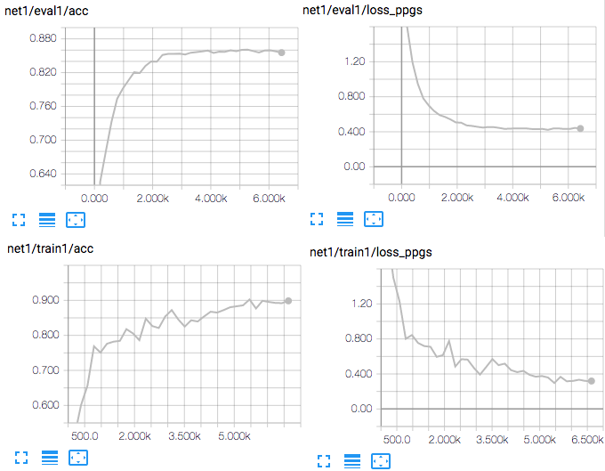

# Cross-lingual Voice Conversion

I wish I could speak many languages. Wait. Actually I do. But only 4 or 5 languages with limited proficiency. Instead, can I create a voice model that can copy any voice in any language? Possibly! A while ago, me and my colleage [Dabi](https://github.com/andabi/deep-voice-conversion) opened a simple voice conversion project. Based on it, I expanded the idea to cross-languages. I found it's very challenging with my limited knowledge. Unfortunately, the results I have for now are not good, but hopefully it will be helpful for some people. 

February 2018 
Author: [Kyubyong Park](kbpark.linguist@gmail.com)
Version: 1.0

## Requirements
  * NumPy >= 1.11.1
  * TensorFlow >= 1.3 
  * librosa
  * tqdm
  * scipy

## Data

  * Training 1: [TIMIT](https://catalog.ldc.upenn.edu/ldc93s1)
  * Training 2: [CMU ARCTIC SLT](http://www.festvox.org/cmu_arctic/dbs_slt.html)
  * Conversion Sample Files: [50LANGUAGES MP3 audio files](https://www.50languages.com/language-mp3.php)

## Architecture 
  * Train 1: MFCCs of TIMIT speakers -> Triphone PPGs
  * Train 2: MFCCs of ARTCTIC speaker -> Triphone PPGs -> linear spectrogram
  * Convert: MFCCs of Any speakers -> Triphone PPGs -> linear spectrogram -> (Griffin-Lim) -> wav file

(To see what PPGs are, consult [this](http://www1.se.cuhk.edu.hk/~hccl/publications/pub/2016_IS16_SunLifa.PDF))

## Training
  * STEP 0. Prepare datasets
  * STEP 1. Run `python train1.py` for phoneme recognition model.
  * STEP 2. Run `python train2.py` for speech synthesis model.

## Training Curves
  * Training 1

  * Training 2

## Sample Synthesis
  * Run `python convert.py` and check the generated samples in `50lang-output` folder.

## Generated Samples

  * Check [here](https://soundcloud.com/kyubyong-park/sets/cross-lingual-voice-conversion) and compare original speech samples in 16 languages and their converted counterparts. 
  * Don't expect too much!

## References
  * [L. Sun, S. Kang, K. Li, and H. Meng, “Personalized, cross-lingual TTS using phonetic posteriorgrams,” in Proc. INTERSPEECH, San Francisco, U.S.A., Sep. 2016, pp. 322–326.](http://www1.se.cuhk.edu.hk/~hccl/publications/pub/2016_IS16_SunLifa.PDF)
  * Dabi Ahn & Kyubyong Park, Voice Conversion with Non-Parallel Data. https://github.com/andabi/deep-voice-conversion

